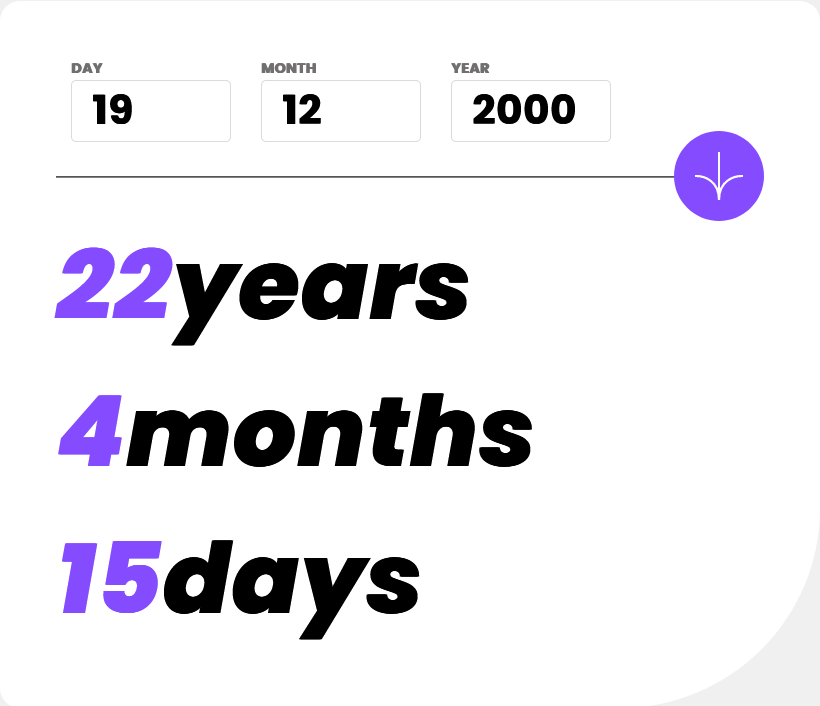
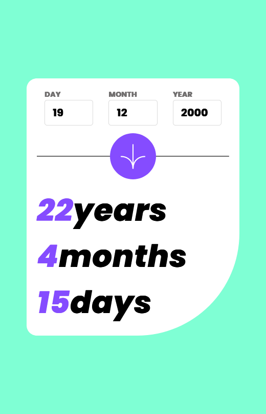
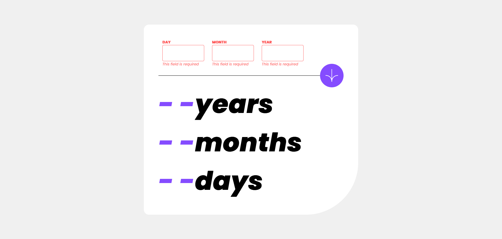
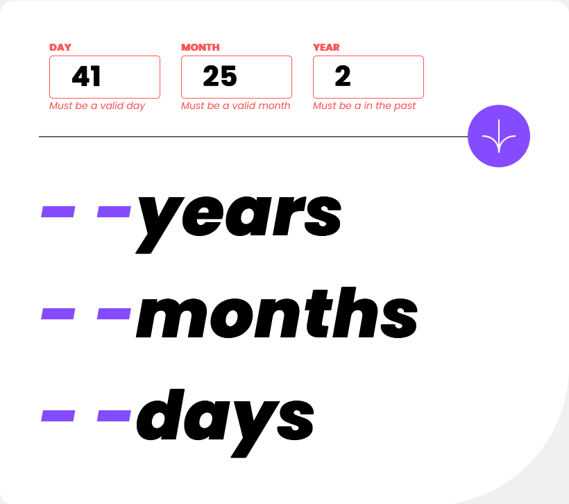

# Frontend Mentor - Age calculator app solution

This is a solution to the [Age calculator app challenge on Frontend Mentor](https://www.frontendmentor.io/challenges/age-calculator-app-dF9DFFpj-Q). Frontend Mentor challenges help you improve your coding skills by building realistic projects. 

## Table of contents

- [Overview](#overview)
  - [The challenge](#the-challenge)
  - [Screenshot](#screenshot)
  - [Links](#links)
- [My process](#my-process)
  - [Built with](#built-with)
  - [What I learned](#what-i-learned)
  - [Continued development](#continued-development)
  - [Useful resources](#useful-resources)
- [Author](#author)


## Overview

### The challenge

Users should be able to:

- View an age in years, months, and days after submitting a valid date through the form
- Receive validation errors if:
  - Any field is empty when the form is submitted
  - The day number is not between 1-31
  - The month number is not between 1-12
  - The year is in the future
  - The date is invalid e.g. 31/04/1991 (there are 30 days in April)
- View the optimal layout for the interface depending on their device's screen size
- See hover and focus states for all interactive elements on the page
- **Bonus**: See the age numbers animate to their final number when the form is submitted

### Screenshot






### Links

- Live Site URL: [https://age-calculator.onrender.com/](https://age-calculator.onrender.com/)

## My process

### Built with

- Semantic HTML5 markup
- CSS custom properties
- Flexbox
- CSS Grid
- Mobile-first workflow


### What I learned

I learnt how the Age Calculator works.

To see how you can add code snippets, see below:

```html

  <head>
    <meta charset="UTF-8" />
    <meta name="viewport" content="width=device-width, initial-scale=1.0" />
    <!-- displays site properly based on user's device -->

    <link
      rel="icon"
      type="image/png"
      sizes="32x32"
      href="./assets/images/favicon-32x32.png"
    />
    <link rel="stylesheet" href="style.css" />
    <script src="./script.js"></script>
    <title>Frontend Mentor | Age calculator app</title>

    <!-- Feel free to remove these styles or customise in your own stylesheet 👍 -->
  </head>
  <body>
    <main id="card">
      <div id="input-container">
        <div class="input-section">
          <h1 id="label-day" class="label">day</h1>
          <input
            id="input-day"
            class="input-box"
            type="text"
            minlength="1"
            maxlength="2"
            name="day"
            onblur="updateDay()"
          />
          <br />
          <span id="day-error" class="error-box" ></span>
        </div>
        <div class="input-section">
          <h1 id="label-month" class="label">month</h1>
          <input
            id="input-month"
            class="input-box"
            type="text"
            minlength="1"
            maxlength="2"
            name="month"
            onblur="updateMonth()"

          />
          <br />

          <span id="month-error" class="error-box"></span>
        </div>
        <div class="input-section">
          <h1 id="label-year" class="label">year</h1>
          <input
            id="input-year"
            class="input-box"
            type="text"
            minlength="4"
            maxlength="4"
            name="year"
            onblur="updateYear()"

          />
          <br />

          <span id="year-error" class="error-box"></span>
        </div>
      </div>
      <div id="horizontal-line">
        <hr />
        <div id="svg-arrow" onclick="ageCalculate()">
          <svg
            xmlns="http://www.w3.org/2000/svg"
            width="46"
            height="44"
            viewBox="0 0 46 44"
          >
            <g fill="none" stroke="#FFF" stroke-width="2">
              <path
                d="M1 22.019C8.333 21.686 23 25.616 23 44M23 44V0M45 22.019C37.667 21.686 23 25.616 23 44"
              />
            </g>
          </svg>
        </div>
      </div>
      <div id="output-conatiner">
        <h1 class="output-text"><span id="years-output">- -</span>years</h1>
        <h1 class="output-text"><span id="months-output">- -</span>months</h1>
        <h1 class="output-text"><span id="days-output">- -</span>days</h1>
      </div>
    </main>
  </body>

```
```css
  @font-face {
      font-family: Poppins-Regular;
      src: url(./assets/fonts/Poppins-Regular.ttf);
  }

  @font-face {
      font-family: Poppins-Bold;
      src: url(./assets/fonts/Poppins-Bold.ttf);
  }

  @font-face {
      font-family: Poppins-BoldItalic;
      src: url(./assets/fonts/Poppins-BoldItalic.ttf);
  }

  @font-face {
      font-family: Poppins-ExtraBold;
      src: url(./assets/fonts/Poppins-ExtraBold.ttf);
  }

  @font-face {
      font-family: Poppins-ExtraBoldItalic;
      src: url(./assets/fonts/Poppins-ExtraBoldItalic.ttf);
  }

  @font-face {
      font-family: Poppins-Italic;
      src: url(./assets/fonts/Poppins-Italic.ttf);
  }

  body {
      margin: 0;
      padding: 0;
      box-sizing: border-box;
      height: 100vh;
      display: grid;
      place-items: center;
      background-color: hsl(0, 0%, 94%);
  }

  * {
      margin: 0;
      padding: 0;
      box-sizing: border-box;
  }

  #card {

      margin: auto 20rem;
      background-color: hsl(0, 0%, 100%);
      padding: 2.8rem;
      width: 41rem;
      height: auto;
      border-radius: 1rem;
      border-bottom-right-radius: 10rem;

  }

  #input-container {
      width: 100%;  
      display: flex;

    }

  .input-section {
      margin: 0 12px;
  }

  .label {
      font-family: "Poppins-Bold";
      font-size: 0.7rem;
      font-weight: 800i;
      text-transform: uppercase;
      color: hsl(0, 1%, 44%);
  }

  .input-box {
      /* margin-left: 4px ; */
      width: 8rem;
      height: 2.5rem;
      padding: 1.5rem;
      border-radius: 4px;
      border: 1px solid hsl(0, 0%, 86%);
      font-size: 32px;
      font-family: "Poppins-Bold";
      font-weight: 700;
      text-align: left;

  }

  input::-webkit-outer-spin-button,
  input::-webkit-inner-spin-button {
      -webkit-appearance: none;
      margin: 0;
  }

  #horizontal-line {
      width: 100%;
      height: 3.5rem;  
      /* background-color: red; */
      position: relative;
      display: flex;
      justify-content: left;
      align-items: center;
  }

  #horizontal-line>hr {
      width: 100%;
  }

  #svg-arrow {
      background-color: hsl(259, 100%, 65%);
      border-radius: 100%;
      height: 4.5rem;
      width: 4.5rem;
      padding:1rem;
      display: flex;
      justify-content: center;
      align-items: center;
      position: absolute;
      right: 0%;
  }
  #svg-arrow:hover{
    background-color: hsl(0, 0%, 8%);
  }

  #output-conatiner{
    box-sizing: border-box;
  }

  .output-text{
    font-family: Poppins-ExtraBoldItalic;
    font-weight: 800i;
    font-size: 4.9rem;
  }
  .output-text > span {
    color :hsl(259, 100%, 65%)
  }

  .error-box {
    display: none;
    height: 1rem;
    font-size : 0.7rem;
    font-family: Poppins-Italic;
    color :hsl(0, 100%, 67%);
    font-weight: 400;
    width: 100%;
    
  }
 
  
```
```js
var day = "";
var month = "";
var year = "";

function updateDay() {
  day = Number(document.getElementById("input-day").value);
  let dayError = document.getElementById("day-error");
  let dayInput = document.getElementById("input-day");
  let dayLabel = document.getElementById("label-day");

  if (day == "") {
    dayError.style.display = "block";
    dayError.textContent = "This field is required";
    dayInput.style.border = "1px solid hsl(0, 100%, 67%)";
    dayLabel.style.color = "hsl(0, 100%, 67%)";
  } else if (isNaN(day) || 0 > day || day > 31) {
    dayError.style.display = "block";
    dayError.textContent = "Must be a valid day";
    dayInput.style.border = "1px solid hsl(0, 100%, 67%)";
    dayLabel.style.color = "hsl(0, 100%, 67%)";
  } else {
    dayError.style.display = "none";
    dayInput.style.border = "1px solid hsl(0, 0%, 86%)";
    dayLabel.style.color = "hsl(0, 1%, 44%)";
  }
}
function updateMonth() {
  month = Number(document.getElementById("input-month").value);
  let monthError = document.getElementById("month-error");
  let monthInput = document.getElementById("input-month");
  let monthLabel = document.getElementById("label-month");

  if (month == "") {
    monthError.style.display = "block";
    monthError.textContent = "This field is required";
    monthInput.style.border = "1px solid hsl(0, 100%, 67%)";
    monthLabel.style.color = "hsl(0, 100%, 67%)";
  } else if (isNaN(month) || 0 > month || month > 12) {
    monthError.style.display = "block";
    monthError.textContent = "Must be a valid month";
    monthInput.style.border = "1px solid hsl(0, 100%, 67%)";
    monthLabel.style.color = "hsl(0, 100%, 67%)";
  } else {
    monthError.style.display = "none";
    monthInput.style.border = "1px solid hsl(0, 0%, 86%)";
    monthLabel.style.color = "hsl(0, 1%, 44%)";
  }
}
function updateYear() {
  year = Number(document.getElementById("input-year").value);
  let yearError = document.getElementById("year-error");
  let yearInput = document.getElementById("input-year");
  let yearLabel = document.getElementById("label-year");

  if (year == "") {
    yearError.style.display = "block";
    yearError.textContent = "This field is required";
    yearInput.style.border = "1px solid hsl(0, 100%, 67%)";
    yearLabel.style.color = "hsl(0, 100%, 67%)";
  } else if (
    isNaN(year) ||
    new Date().getFullYear() < year ||
    String(year).length != 4
  ) {
    yearError.style.display = "block";
    yearError.textContent = "Must be a in the past";
    yearInput.style.border = "1px solid hsl(0, 100%, 67%)";
    yearLabel.style.color = "hsl(0, 100%, 67%)";
  } else {
    yearError.style.display = "none";
    yearInput.style.border = "1px solid hsl(0, 0%, 86%)";
    yearLabel.style.color = "hsl(0, 1%, 44%)";
  }
}

const months = [31, 28, 31, 30, 31, 30, 31, 31, 30, 31, 30, 31];

function ageCalculate() {
  day = Number(document.getElementById("input-day").value);
  month = Number(document.getElementById("input-month").value);
  year = Number(document.getElementById("input-year").value);
  let today = new Date();

  console.log(`${day}/${month}/${year}`);
  let inputDate = new Date(year, month, day);
  let birthMonth, birthDate, birthYear;
  let birthDetails = {
    date: inputDate.getDate(),
    month: inputDate.getMonth() + 1,
    year: inputDate.getFullYear(),
  };
  let currentYear = today.getFullYear();
  let currentMonth = today.getMonth() + 1;
  let currentDate = today.getDate();


  leapChecker(currentYear);

  if (
    birthDetails.year > currentYear ||
    (birthDetails.month > currentMonth && birthDetails.year == currentYear) ||
    (birthDetails.date > currentDate &&
      birthDetails.month == currentMonth &&
      birthDetails.year == currentYear)
  ) {
    alert("Not Born Yet");
    displayResult("- -", "- -", "- -");
    return;
  }

  birthYear = currentYear - birthDetails.year;
  console.log(birthYear)
  if (currentMonth >= birthDetails.month) {
    birthMonth = currentMonth - birthDetails.month;
  } else {
    birthYear--;
    birthMonth = 12 + (currentMonth - birthDetails.month);
  }

  if (currentDate >= birthDetails.date) {
    birthDate = currentDate - birthDetails.date;
  } else {
    let days = months[currentMonth - 1];
    birthDate = days + currentDate - birthDetails.date;
    if (birthMonth < 0) {
      birthMonth = 11;
      birthYear--;
    }
  }
  displayResult(birthDate, birthMonth, birthYear);
}

function displayResult(bDate, bMonth, bYear) {
  document.getElementById("years-output").textContent = bYear;
  document.getElementById("months-output").textContent = bMonth;
  document.getElementById("days-output").textContent = bDate;
}

function leapChecker(year) {
  if (year % 4 == 0 || (year % 100 == 0 && year % 400 == 0)) {
    months[1] = 29;
  } else {
    months[1] = 28;
  }
}

```


### Useful resources

- [Calculator.net](https://www.calculator.net/) - This helped me for Formula of the age calculator.


## Author

- Website - [Add your name here](https://www.your-site.com)
- Frontend Mentor - [@sayyedaaman2](https://www.frontendmentor.io/profile/sayyedaaman2)
- Twitter - [@SayyedAaman](https://www.twitter.com/SayyedAaman)


